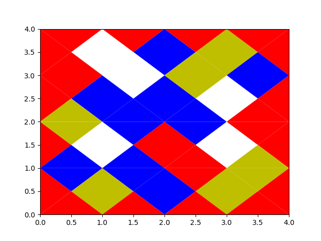

# TetraVex Library and Tools

## Introduction
This library currently provides tools to generate TetraVex problems. The output
executable generates 4x4 TetraVex with 4 colours. This can then be viewed using
the ``plot_scenario.py`` script.

## Building the Project

To build the project you will need a C++ compiler, CMake and the nlohmann JSON
library installed on your system.

[Nlohman JSON Library](https://github.com/nlohmann/json)

Create a build directory, enter that and run:

```bash
cmake ..
make -j
```

The TetraVex tool will then be located in ``build/src/tv``

## Generating and Viewing Scenarios

To generate a solved scenario, run:

```
./tc --generate-solved
```

This will output a json structure similar to the following:

```json
{
    "scenario": [
        {
            "tile": {
                "bottom": 3,
                "left": 3,
                "right": 1,
                "top": 3
            }
        },
        {
            "tile": {
                "bottom": 2,
                "left": 1,
                "right": 0,
                "top": 3
            }
        },
        ...
    ]
}
```

Each tile is presented in order from top left to bottom right. A randomised 
solution can be generated using

```
./tc --generate
```

A scenario can be viewed using the ``tools/plot_scenario.py`` script. This 
uses matplotlib to plot the scenario, and takes json piped into the program:

```bash
cat scenario.json | python3 tools/plot_scenario.py
```

This produces output like this:


